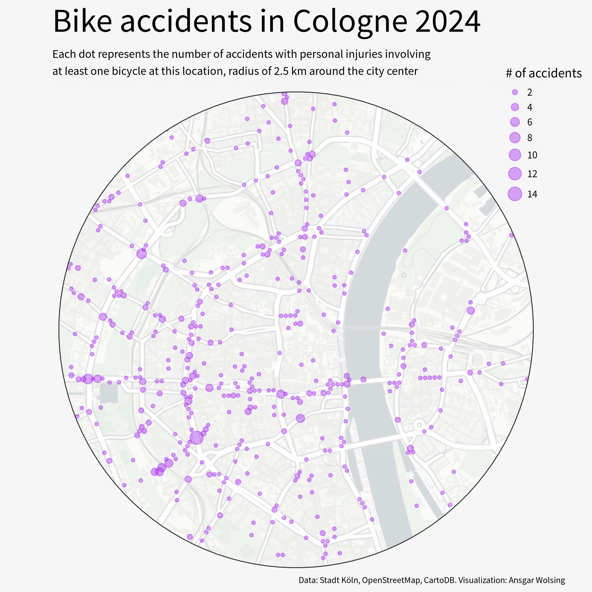
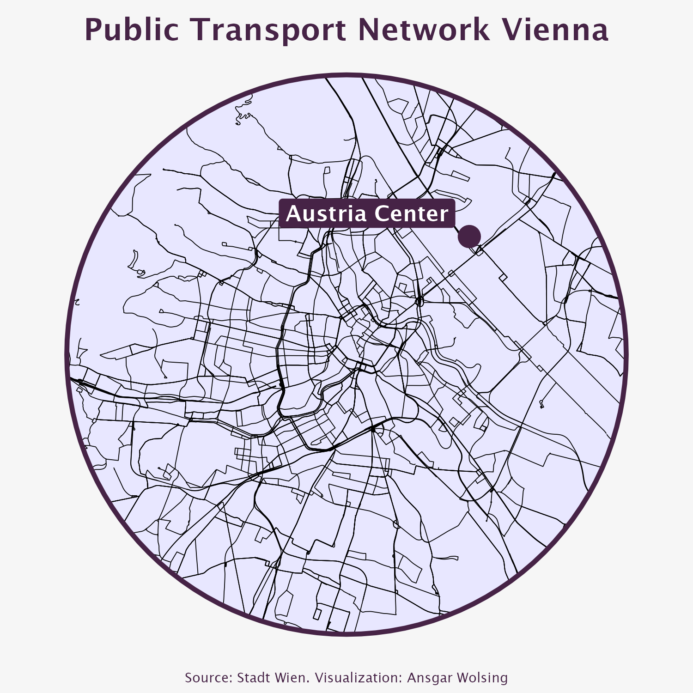
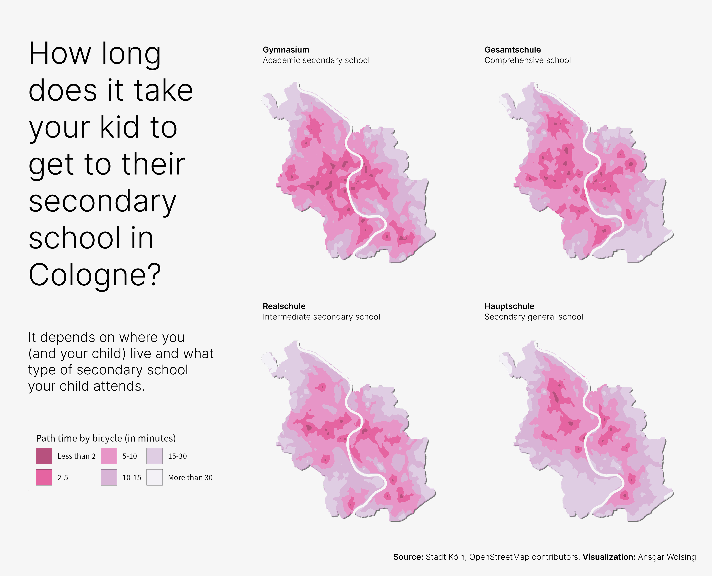
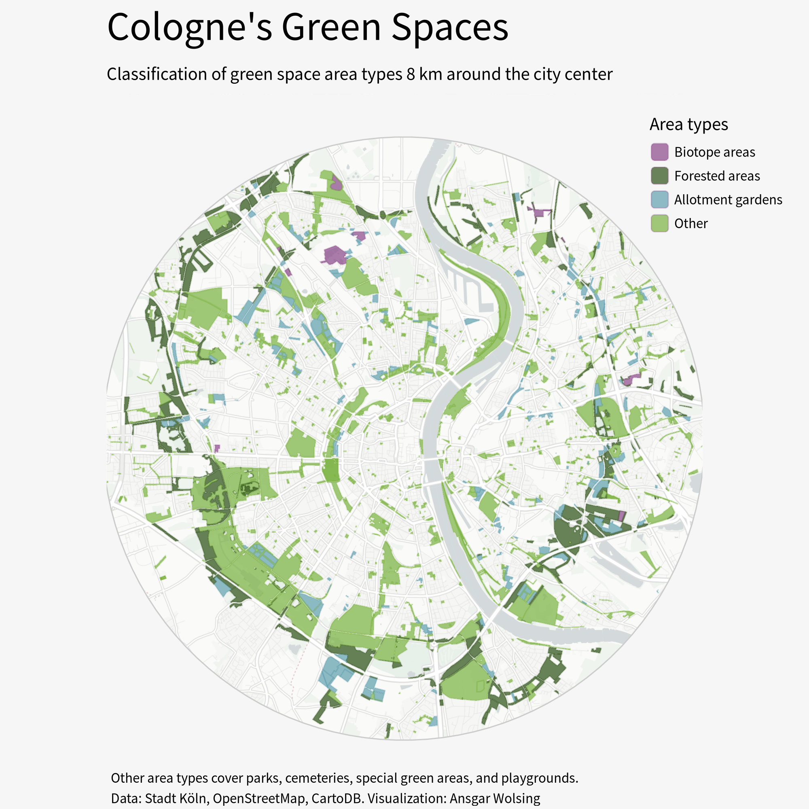
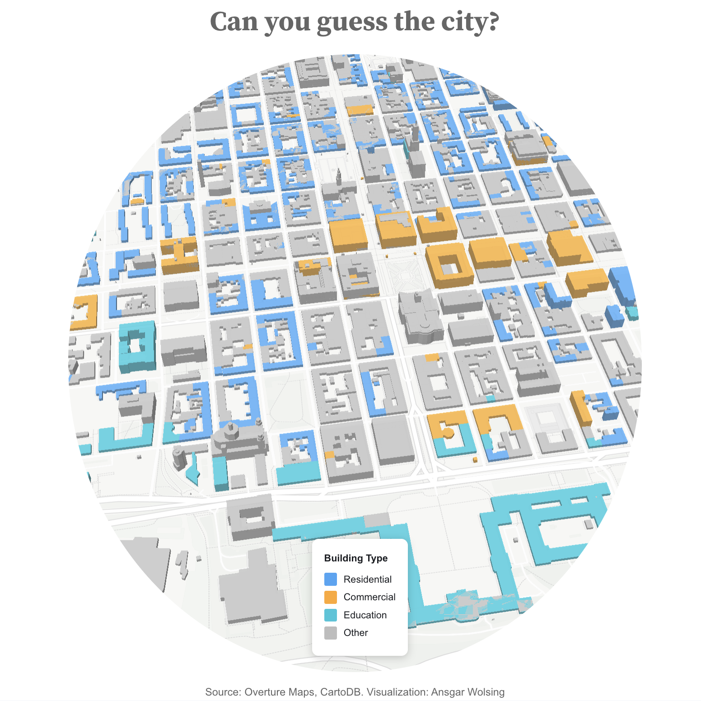
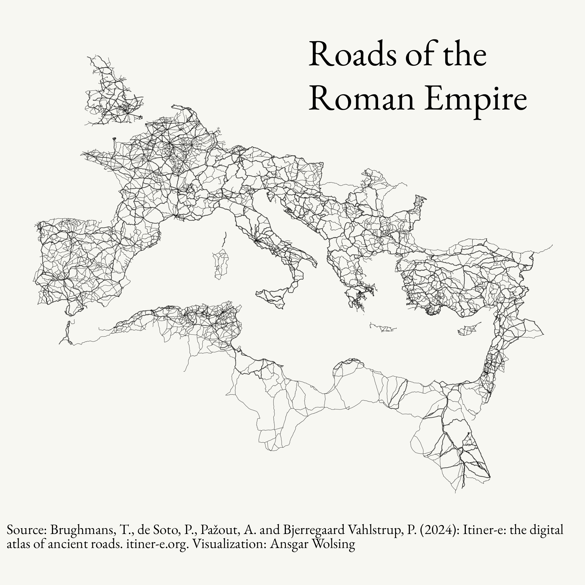
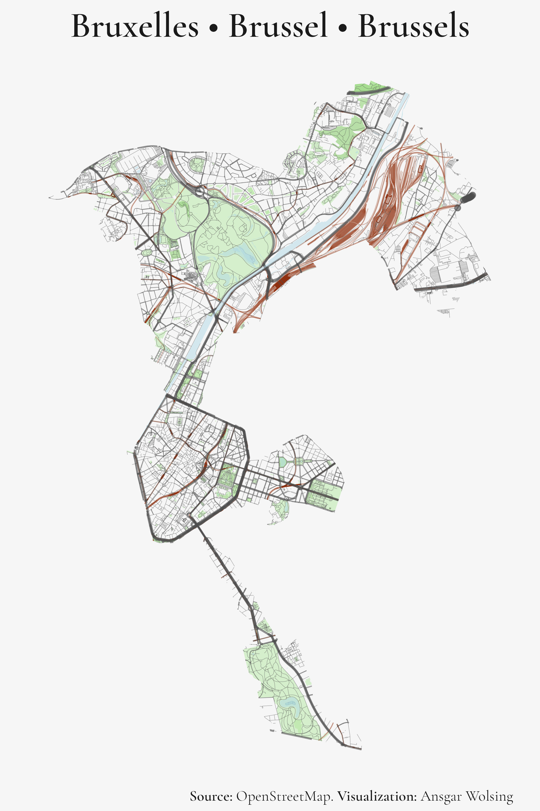
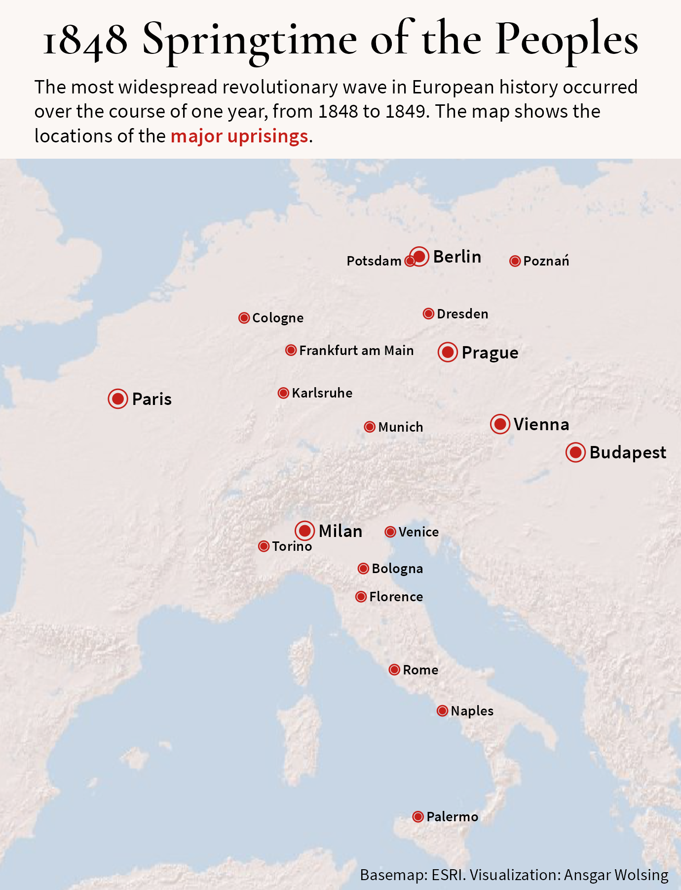
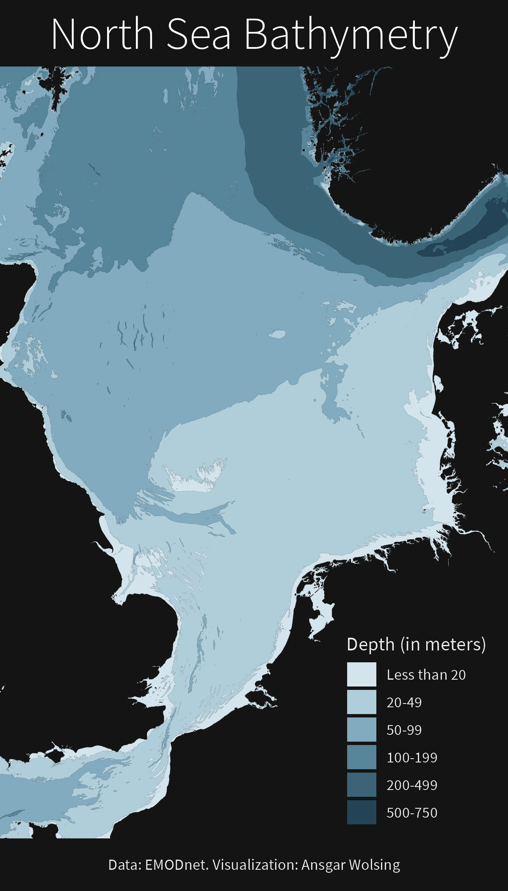
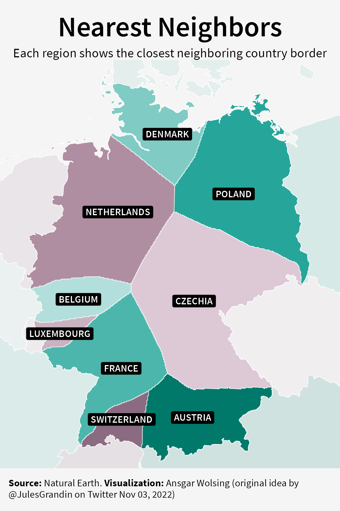

# #30DayMapChallenge 2025

My contributions to the #30DayMapChallenge 2025

## Day 01 - Points

## Day 02 - Lines

## Day 03 - Polygons

## Day 05 - Earth

## Day 08 - Urban

## Day 10 - Air

## Day 11 - Minimal map

## Day 14 - OpenStreetMap

## Day 15 - Fire

## Day 20 - Water

## Day 21 - Icons
<iframe width='100%' height='400px' src="https://api.mapbox.com/styles/v1/ansgarw/cmi9c14di003l01s6di1qd3x0.html?title=false&access_token=pk.eyJ1IjoiYW5zZ2FydyIsImEiOiJjbWhobXA0cGgwdHJhMmtyNGd2Zmg2dzVyIn0.g1hXKAmGdEOS5y1fpa1SYg&zoomwheel=false#14.56/50.92813/6.95227/0/69" title="Cologne Christmas Markets 2025" style="border:none;"></iframe>

## Day 22 - Natural Earth

